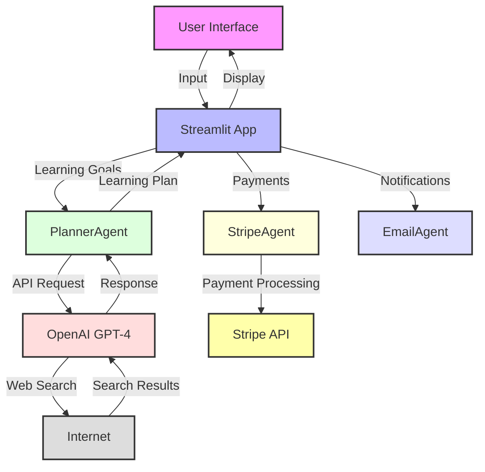
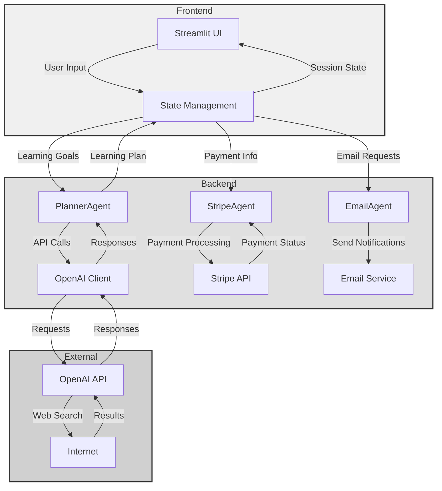
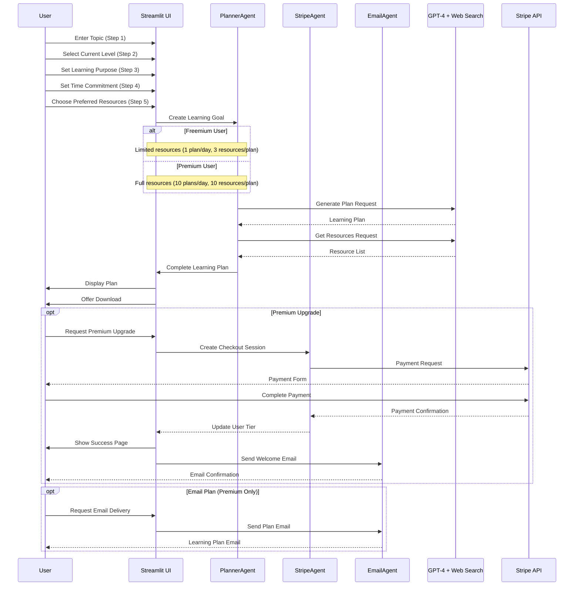
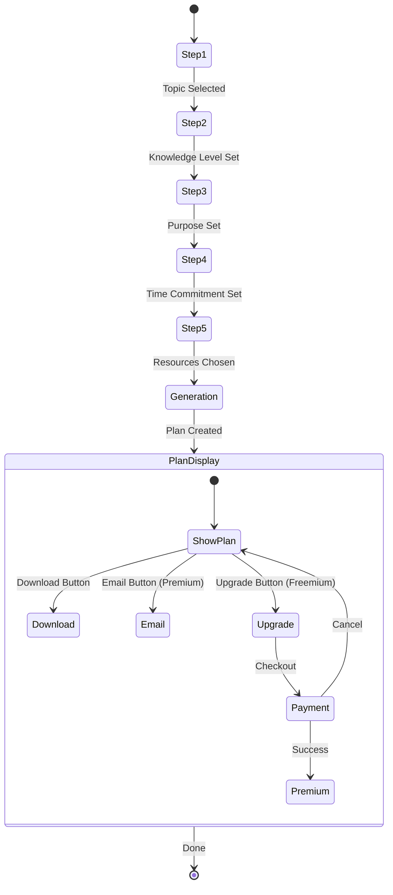
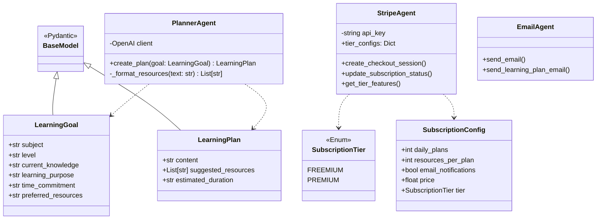

# CoachAI Learning Wizard 🎓

CoachAI is an intelligent learning path generator that creates personalized learning plans using OpenAI's GPT-4 and web search capabilities. It helps learners create structured, up-to-date learning paths tailored to their goals, current level, and learning style.

## Features ✨

- 🎯 Personalized learning plan generation
- 🌐 Real-time web search integration for current resources
- 🎨 Learning style adaptation
- ⏱️ Time-based planning
- 📚 Curated resource recommendations
- 💾 Downloadable learning plans
- 💳 Subscription tiers with Stripe integration
- 📧 Email notifications for premium users
- 🔑 In-app OpenAI API key configuration

## System Architecture 🏗️

### High-Level Overview



### Detailed Component Architecture



## User Flow 🔄



## Prerequisites 📋

- Python 3.9+
- OpenAI API key
- Stripe API key (for subscription features)
- Streamlit
- Internet connection for web search functionality

## Quick Start 🚀

### Installation

1. Clone the repository:
```bash
git clone https://github.com/yourusername/CoachAI.git
cd CoachAI
```

2. Create a virtual environment:
```bash
python -m venv venv
source venv/bin/activate  # Unix
venv\Scripts\activate     # Windows
```

3. Install dependencies:
```bash
pip install -r requirements.txt
pip install -r requirements-dev.txt  # For development
```

4. Set up your API keys:
```bash
# Create a .env file or export directly
export OPENAI_API_KEY='your-openai-api-key-here'
export STRIPE_SECRET_KEY='your-stripe-secret-key-here'
export STRIPE_WEBHOOK_SECRET='your-stripe-webhook-secret-here'
```

### Usage

1. Start the Streamlit app:
```bash
streamlit run ui/web/app.py
```

2. Follow the 5-step wizard to create your learning plan:
   - Step 1: Choose your learning topic
   - Step 2: Specify your current knowledge level
   - Step 3: Define your learning purpose
   - Step 4: Set your time commitment
   - Step 5: Select preferred learning resources

3. Get your personalized learning plan!

4. Upgrade to Premium for additional features:
   - 10 learning plans per day (vs 1 for free users)
   - 10 resources per plan (vs 3 for free users)
   - Email delivery of learning plans
   - Priority support

5. Configure your OpenAI API key in the app:
   - Expand the "⚙️ API Settings" section in the sidebar
   - Enter your OpenAI API key
   - Click "Save API Key"

## Development Guide 👩‍💻

### Project Structure 📁

```
CoachAI/
├── agents/
│   ├── planner.py         # Core planning logic and OpenAI integration
│   ├── email_agent.py     # Email notification handling
│   └── stripe_agent.py    # Subscription and payment processing
├── ui/
│   └── web/
│       └── app.py         # Streamlit web interface
├── src/
│   └── config.py          # Configuration and settings
├── tests/
│   ├── test_planner.py
│   ├── test_stripe.py
│   └── test_ui.py
└── README.md             # Project documentation
```

### Component Details

#### 1. Streamlit UI Flow



#### 2. Core Classes



### API Integration 🔌

#### OpenAI

```python
# Example OpenAI Responses API call
response = client.responses.create(
    model="gpt-4o",
    tools=[{"type": "web_search_preview"}],
    input="Your prompt here"
)
```

#### Stripe

```python
# Example Stripe checkout session creation
checkout_session = stripe.checkout.Session.create(
    success_url="http://localhost:8501/success?session_id={CHECKOUT_SESSION_ID}",
    cancel_url="http://localhost:8501/cancel",
    mode="subscription",
    line_items=[{"price": "price_id", "quantity": 1}]
)
```

### Session State Management

The application uses Streamlit's session state for maintaining user data across steps:

```python
# Session state initialization
if "step" not in st.session_state:
    st.session_state.step = 1

if "subject" not in st.session_state:
    st.session_state.subject = ""

# Form handling with session state
subject_value = st.session_state.get("subject", "")
subject = st.text_input("Subject or Topic", value=subject_value)

# Storing values in session state
if st.button("Next"):
    st.session_state["subject"] = subject
    next_step()
```

### Webhook Handling

For handling Stripe webhooks, we use a dedicated endpoint in the Streamlit app:

```python
async def handle_webhook():
    """Handle incoming Stripe webhook events."""
    # Verify webhook signature
    # Process different event types like 'checkout.session.completed'
    # Update user subscription status
```

### Code Style 📝

We follow PEP 8 with these additions:
- Line length: 88 characters (Black formatter)
- Docstring style: Google format
- Type hints: Required for all functions

Example:
```python
def process_data(input_data: str) -> Dict[str, Any]:
    """Process the input data and return results.

    Args:
        input_data: The raw input string to process.

    Returns:
        Dict containing processed results.

    Raises:
        ValueError: If input_data is invalid.
    """
    pass
```

### Testing 🧪

Run tests with:
```bash
pytest tests/                    # Run all tests
pytest tests/ -v --cov=src      # With coverage
pytest tests/integration/       # Integration tests
```

### Deployment 🚀

#### Production Setup

1. Environment variables:
```bash
OPENAI_API_KEY=your-key-here
STRIPE_SECRET_KEY=your-stripe-key-here
STRIPE_WEBHOOK_SECRET=your-webhook-secret-here
STREAMLIT_SERVER_PORT=8501
```

2. Docker deployment:
```dockerfile
FROM python:3.9-slim
WORKDIR /app
COPY . .
RUN pip install -r requirements.txt
CMD ["streamlit", "run", "ui/web/app.py"]
```

### Best Practices 🎯

1. Performance Optimization:
   - Cache frequent API requests
   - Implement rate limiting
   - Monitor memory usage
   - Handle concurrent users

2. Security:
   - Use environment variables for secrets
   - Implement key rotation
   - Sanitize inputs
   - Validate form data before submission
   - Verify webhook signatures

### Troubleshooting 🔍

1. OpenAI API Issues:
   - Verify API key and format
   - Check rate limits
   - Monitor usage
   - Use the in-app API key configuration if needed

2. Stripe API Issues:
   - Validate API keys
   - Check webhook configuration
   - Ensure correct product/price setup
   - Test with Stripe CLI

3. Streamlit Issues:
   - Clear cache: `streamlit cache clear`
   - Check port conflicts
   - Verify session state initialization
   - Check for widget key conflicts

4. Form Data Issues:
   - Ensure all input validation is in place
   - Check for empty string values in session state
   - Validate selections against available options
   - Use defensive programming for all form inputs

## Recent Improvements 🆕

- 🔧 Enhanced session state management to maintain data between steps
- 🛠️ Improved form validation and error handling
- 🔐 Added in-app OpenAI API key configuration
- 🔍 Better debugging for API connections 
- 🧪 Fixed handling of multiselect values between steps
- 🔄 Better loading indicators and error messages

## Contributing 🤝

1. Fork the repository
2. Create your feature branch (`git checkout -b feature/AmazingFeature`)
3. Write tests and documentation
4. Commit your changes (`git commit -m 'Add some AmazingFeature'`)
5. Push to the branch (`git push origin feature/AmazingFeature`)
6. Open a Pull Request

## License 📄

This project is licensed under the MIT License - see the LICENSE file for details.

## Acknowledgments 🙏

- OpenAI for their powerful GPT-4 API
- Stripe for payment processing
- Streamlit for the amazing web framework
- All contributors and users of CoachAI

## Support 💪

For support, please open an issue in the GitHub repository or contact the maintainers.

---

Made with ❤️ by [Your Name/Team] 