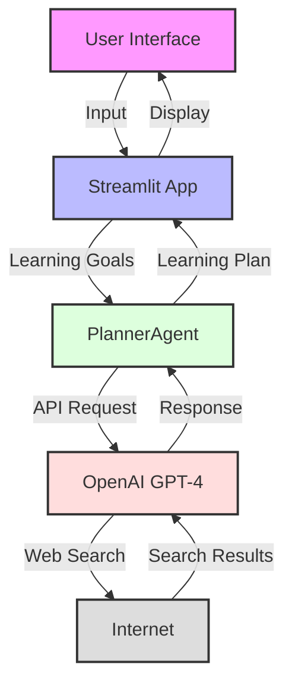
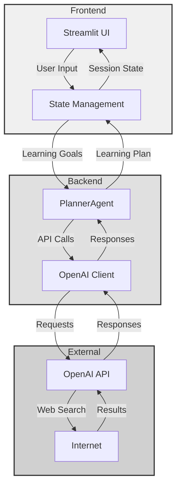
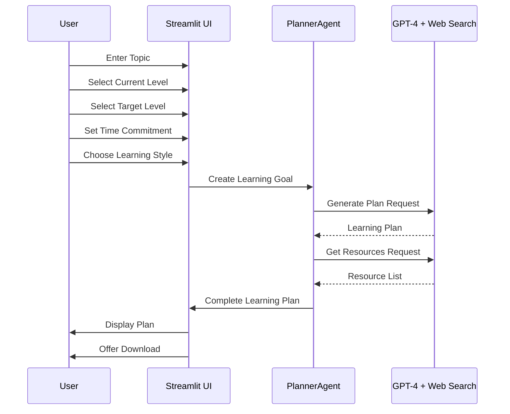
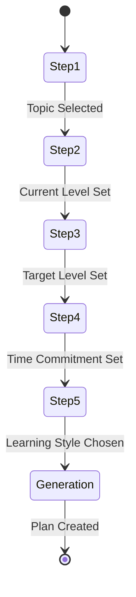
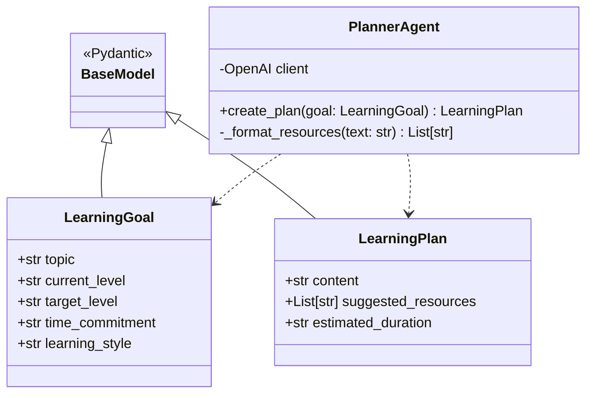

# CoachAI Learning Wizard 🎓

CoachAI is an intelligent learning path generator that creates personalized learning plans using OpenAI's GPT-4 and web search capabilities. It helps learners create structured, up-to-date learning paths tailored to their goals, current level, and learning style.

## Features ✨

- 🎯 Personalized learning plan generation
- 🌐 Real-time web search integration for current resources
- 🎨 Learning style adaptation
- ⏱️ Time-based planning
- 📚 Curated resource recommendations
- 💾 Downloadable learning plans

## System Architecture 🏗️

### High-Level Overview



### Detailed Component Architecture



## User Flow 🔄



## Prerequisites 📋

- Python 3.9+
- OpenAI API key
- Streamlit
- Internet connection for web search functionality

## Quick Start 🚀

### Installation

1. Clone the repository:
```bash
git clone https://github.com/yourusername/CoachAI.git
cd CoachAI
```

2. Create a virtual environment:
```bash
python -m venv venv
source venv/bin/activate  # Unix
venv\Scripts\activate     # Windows
```

3. Install dependencies:
```bash
pip install streamlit openai
pip install -r requirements-dev.txt  # For development
```

4. Set up your OpenAI API key:
```bash
export OPENAI_API_KEY='your-api-key-here'
```

### Usage

1. Start the Streamlit app:
```bash
python -m streamlit run ui/web/app.py
```

2. Follow the 5-step wizard:
   - Choose your learning topic
   - Specify your current level
   - Set your target level
   - Define time commitment
   - Select learning style preference

3. Get your personalized learning plan!

## Development Guide 👩‍💻

### Project Structure 📁

```
CoachAI/
├── agents/
│   └── planner.py         # Core planning logic and OpenAI integration
├── ui/
│   └── web/
│       └── app.py         # Streamlit web interface
├── src/
│   └── config.py          # Configuration and settings
├── tests/
│   ├── test_planner.py
│   ├── test_ui.py
│   └── conftest.py
└── README.md             # Project documentation
```

### Component Details

#### 1. Streamlit UI Flow



#### 2. Core Classes



### API Integration 🔌

```python
# Example OpenAI Responses API call
response = client.responses.create(
    model="gpt-4.1",
    tools=[{"type": "web_search_preview"}],
    input="Your prompt here"
)
```

### Code Style 📝

We follow PEP 8 with these additions:
- Line length: 88 characters (Black formatter)
- Docstring style: Google format
- Type hints: Required for all functions

Example:
```python
def process_data(input_data: str) -> Dict[str, Any]:
    """Process the input data and return results.

    Args:
        input_data: The raw input string to process.

    Returns:
        Dict containing processed results.

    Raises:
        ValueError: If input_data is invalid.
    """
    pass
```

### Testing 🧪

Run tests with:
```bash
pytest tests/                    # Run all tests
pytest tests/ -v --cov=src      # With coverage
pytest tests/integration/       # Integration tests
```

### Deployment 🚀

#### Production Setup

1. Environment variables:
```bash
OPENAI_API_KEY=your-key-here
STREAMLIT_SERVER_PORT=8501
```

2. Docker deployment:
```dockerfile
FROM python:3.9-slim
WORKDIR /app
COPY . .
RUN pip install -r requirements.txt
CMD ["streamlit", "run", "ui/web/app.py"]
```

### Best Practices 🎯

1. Performance Optimization:
   - Cache frequent API requests
   - Implement rate limiting
   - Monitor memory usage
   - Handle concurrent users

2. Security:
   - Use environment variables for secrets
   - Implement key rotation
   - Sanitize inputs
   - Validate responses

### Troubleshooting 🔍

1. OpenAI API Issues:
   - Verify API key and format
   - Check rate limits
   - Monitor usage

2. Streamlit Issues:
   - Clear cache: `streamlit cache clear`
   - Check port conflicts
   - Verify dependencies

## Contributing 🤝

1. Fork the repository
2. Create your feature branch (`git checkout -b feature/AmazingFeature`)
3. Write tests and documentation
4. Commit your changes (`git commit -m 'Add some AmazingFeature'`)
5. Push to the branch (`git push origin feature/AmazingFeature`)
6. Open a Pull Request

## License 📄

This project is licensed under the MIT License - see the LICENSE file for details.

## Acknowledgments 🙏

- OpenAI for their powerful GPT-4 API
- Streamlit for the amazing web framework
- All contributors and users of CoachAI

## Support 💪

For support, please open an issue in the GitHub repository or contact the maintainers.

---

Made with ❤️ by [Your Name/Team] 