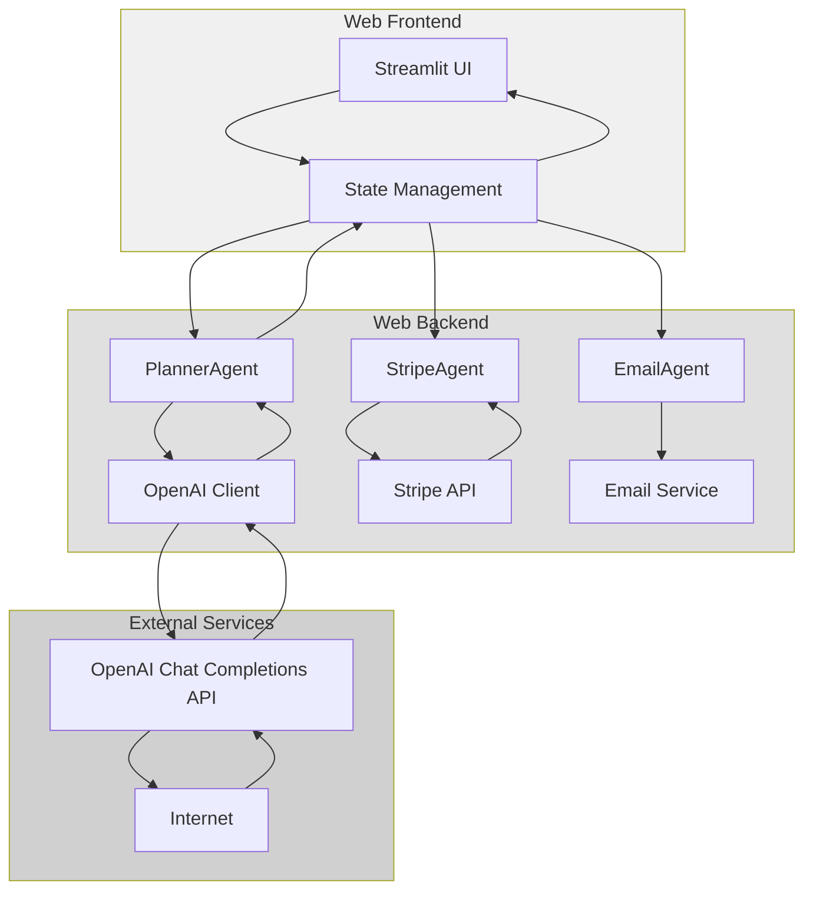
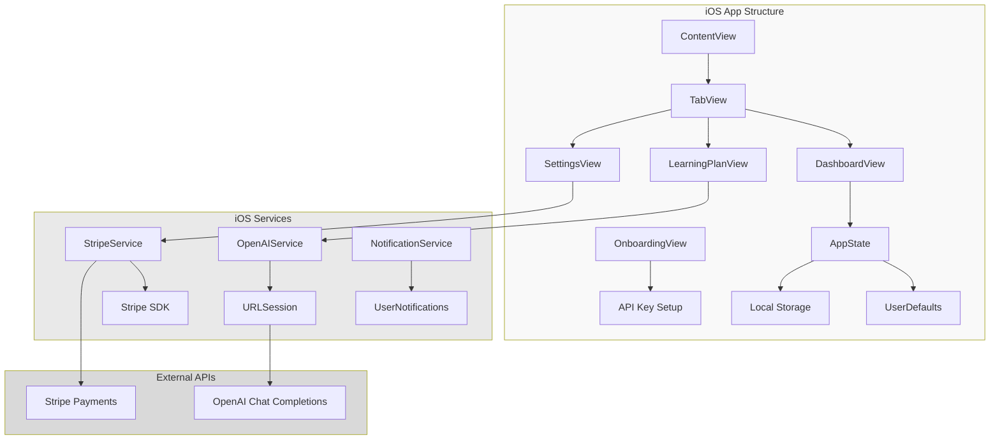
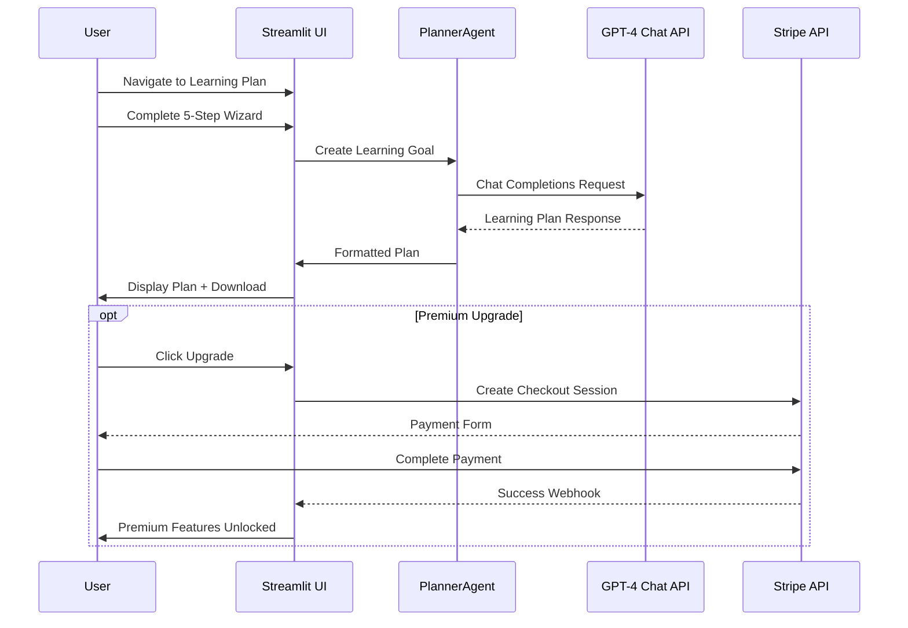
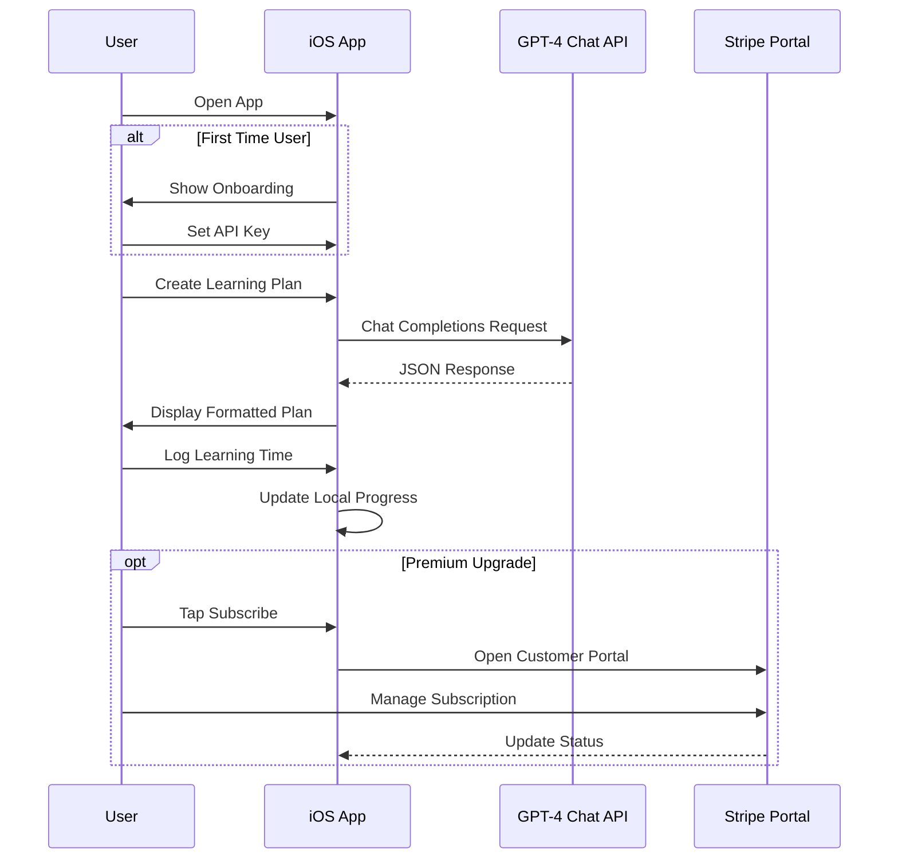

# CoachAI Learning Platform 🎓

CoachAI is a comprehensive AI-powered learning platform that creates personalized learning plans using OpenAI's GPT-4 API. Available as both a web application and native iOS app, it helps learners create structured, up-to-date learning paths tailored to their goals, current level, and learning style.

## Platform Overview 📱💻

### Web Application
- 🌐 Streamlit-based web interface
- 🎯 5-step learning plan wizard
- 📊 Comprehensive dashboard
- 💳 Stripe subscription integration
- 📧 Email notifications

### iOS Application
- 📱 Native SwiftUI interface
- 🔄 Onboarding flow for new users
- 📊 Progress tracking and time logging
- ⚙️ In-app API key configuration
- 🌙 Dark/Light mode support
- 💰 Premium subscription with Stripe integration

## Features ✨

### Core Features
- 🎯 Personalized learning plan generation
- 🌐 Real-time web search integration for current resources
- 🎨 Learning style adaptation
- ⏱️ Time-based planning and tracking
- 📊 Comprehensive dashboard for learning progress
- 🌙 Dark mode UI for better visibility
- 📚 Curated resource recommendations
- 💾 Downloadable learning plans
- 🔑 OpenAI API key configuration

### Premium Features
- 💳 Subscription tiers with Stripe integration
- 📧 Email notifications for premium users
- 🚀 Unlimited learning plans (vs 1/day for free)
- 📚 10 resources per plan (vs 3 for free)
- 🎯 Advanced analytics and progress tracking
- 🏆 Priority support

## System Architecture 🏗️

### High-Level Multi-Platform Architecture

```mermaid
graph TD
    subgraph Client [Client Applications]
        A [Web App - Streamlit] 
        B [iOS App - SwiftUI]
    end
    
    subgraph Services [Core Services]
        C [OpenAI GPT-4 API]
        D [Stripe Payment API]
        E [Email Service]
    end
    
    subgraph Storage [Data Storage]
        F [Local Storage - Web]
        G [UserDefaults - iOS]
        H [Supabase - Optional]
    end
    
    A --> C
    B --> C
    A --> D
    B --> D
    A --> E
    A --> F
    B --> G
    A --> H
    B --> H

    style A fill:#bbf
    style B fill:#f9f
    style C fill:#fdd
    style D fill:#ffd
    style E fill:#ddf
```

### Web Application Architecture



### iOS Application Architecture



## API Integration Details 🔌

### OpenAI Chat Completions API

Both platforms now use the correct OpenAI Chat Completions API:

```python
# Web Application (Python)
response = client.chat.completions.create(
    model="gpt-4-turbo-preview",
    messages=[
        {"role": "system", "content": "You are a learning plan expert..."},
        {"role": "user", "content": user_prompt}
    ],
    max_tokens=2000,
    temperature=0.7
)
```

```swift
// iOS Application (Swift)
let requestBody: [String: Any] = [
    "model": "gpt-4-turbo-preview",
    "messages": [
        ["role": "system", "content": "You are a learning plan expert..."],
        ["role": "user", "content": userPrompt]
    ],
    "max_tokens": 2000,
    "temperature": 0.7,
    "response_format": ["type": "json_object"]
]
```

### Stripe Integration

```python
# Web Application
checkout_session = stripe.checkout.Session.create(
    success_url="http://localhost:8501/success?session_id={CHECKOUT_SESSION_ID}",
    cancel_url="http://localhost:8501/cancel",
    mode="subscription",
    line_items=[{"price": "price_premium_monthly", "quantity": 1}]
)
```

```swift
// iOS Application
// Stripe integration through web views and customer portal
func initiateStripeSubscription() {
    // Opens Stripe checkout in web view
    // Handles subscription status updates
}
```

## Platform-Specific Features 📱💻

### Web Application Features
- **5-Step Wizard**: Guided learning plan creation
- **Real-time Dashboard**: Progress tracking with charts
- **Email Delivery**: Send plans via email (Premium)
- **Downloadable Plans**: PDF/text export
- **Session Persistence**: Maintains state across browser sessions

### iOS Application Features
- **Native UI**: SwiftUI interface with iOS design patterns
- **Onboarding Flow**: Welcome screens and API key setup
- **Local Storage**: All data stored securely on device
- **Time Tracking**: Built-in timer and progress logging
- **Offline Access**: View plans without internet connection
- **Push Notifications**: Learning reminders (Premium)
- **Dark Mode**: Automatic theme switching

## User Flow Comparison 🔄

### Web Application Flow


### iOS Application Flow


## Installation & Setup 🚀

### Web Application Setup

1. **Clone the repository:**
```bash
git clone https://github.com/yourusername/CoachAI.git
cd CoachAI
```

2. **Create virtual environment:**
```bash
python -m venv venv
source venv/bin/activate  # Unix
venv\Scripts\activate     # Windows
```

3. **Install dependencies:**
```bash
pip install -r requirements.txt
```

4. **Set up environment variables:**
```bash
export OPENAI_API_KEY='your-openai-api-key-here'
export STRIPE_SECRET_KEY='your-stripe-secret-key-here'
export STRIPE_WEBHOOK_SECRET='your-stripe-webhook-secret-here'
```

5. **Run the application:**
```bash
streamlit run ui/web/app.py
```

### iOS Application Setup

1. **Prerequisites:**
   - Xcode 14.0+
   - iOS 15.6+ deployment target
   - Apple Developer Account (for App Store submission)

2. **Open project:**
```bash
cd ios/CoachAI
open CoachAI.xcodeproj
```

3. **Configure signing:**
   - Set your Team in project settings
   - Configure Bundle Identifier
   - Set up provisioning profiles

4. **Build and run:**
   - Select target device/simulator
   - Press Cmd+R to build and run

5. **App Store preparation:**
```bash
# Use the provided build script
./build_for_appstore.sh
```

## Project Structure 📁

```
CoachAI/
├── agents/                     # Web app backend logic
│   ├── planner.py             # Core planning with Chat Completions API
│   ├── email_agent.py         # Email notification handling
│   └── stripe_agent.py        # Subscription and payment processing
├── ui/
│   └── web/                   # Web application
│       ├── app.py             # Main Streamlit interface
│       ├── dashboard.py       # Learning tracking dashboard
│       ├── theme.py           # Dark mode and UI theming 
│       └── utils.py           # Helper functions
├── ios/                       # iOS application
│   └── CoachAI/
│       ├── CoachAI/
│       │   ├── Views/         # SwiftUI views
│       │   │   ├── ContentView.swift
│       │   │   ├── DashboardView.swift
│       │   │   ├── LearningPlanView.swift
│       │   │   ├── SettingsView.swift
│       │   │   └── OnboardingView.swift
│       │   ├── ViewModels/    # MVVM architecture
│       │   ├── Models/        # Data models
│       │   ├── Services/      # API services
│       │   └── Resources/     # Assets and configurations
│       ├── README.md          # iOS-specific documentation
│       ├── AppStoreMetadata.md # App Store submission details
│       └── build_for_appstore.sh # Build automation script
├── src/
│   ├── config.py              # Configuration and settings
│   └── storage.py             # User data persistence
├── tests/                     # Test suites
└── README.md                  # This file
```

## API Endpoints & Data Models 📊

### Core Data Models

```python
# Web Application Models
class LearningGoal(BaseModel):
    subject: str
    level: str
    current_knowledge: str
    learning_purpose: str
    time_commitment: str
    preferred_resources: List[str]

class LearningPlan(BaseModel):
    content: str
    suggested_resources: List[str]
    estimated_duration: str
    created_at: datetime
```

```swift
// iOS Application Models
struct LearningPlan: Codable, Identifiable {
    let id = UUID()
    let topic: String
    let timeline: String
    let format: PlanFormat
    let content: String
    let resources: [Resource]
    let estimatedHours: Double
    let createdAt: Date
}

struct Resource: Codable, Identifiable {
    let id = UUID()
    let title: String
    let url: String
    let type: ResourceType
    let description: String
}
```

### Subscription Tiers

| Feature | Freemium | Premium ($9.99/month) |
|---------|----------|----------------------|
| Learning Plans/Day | 1 | Unlimited |
| Resources per Plan | 3 | 10 |
| Email Notifications | ❌ | ✅ |
| Progress Analytics | Basic | Advanced |
| Priority Support | ❌ | ✅ |
| Offline Access (iOS) | ✅ | ✅ |
| Time Tracking | ✅ | ✅ |

## Development Guidelines 👩‍💻

### Web Application Development

1. **Code Style:**
   - Follow PEP 8
   - Use type hints
   - Google-style docstrings

2. **Testing:**
```bash
pytest tests/                    # Run all tests
pytest tests/ -v --cov=src      # With coverage
```

### iOS Application Development

1. **Code Style:**
   - Follow Swift API Design Guidelines
   - Use SwiftUI best practices
   - MVVM architecture pattern

2. **Testing:**
```bash
# Run from Xcode
Cmd+U  # Run unit tests
```

3. **App Store Submission:**
```bash
# Use provided script
./ios/CoachAI/build_for_appstore.sh
```

## Security & Privacy 🔒

### Data Handling
- **Web App**: Session-based storage, optional Supabase integration
- **iOS App**: Local storage only, encrypted API keys
- **API Keys**: User-provided, stored securely
- **Payments**: Processed through Stripe (PCI compliant)

### Privacy Features
- No personal data collection without consent
- Local-first approach on iOS
- Optional analytics (can be disabled)
- GDPR compliant data handling

## Deployment 🚀

### Web Application Deployment

**Docker:**
```dockerfile
FROM python:3.9-slim
WORKDIR /app
COPY . .
RUN pip install -r requirements.txt
EXPOSE 8501
CMD ["streamlit", "run", "ui/web/app.py", "--server.port=8501", "--server.address=0.0.0.0"]
```

**Environment Variables:**
```bash
OPENAI_API_KEY=your-key-here
STRIPE_SECRET_KEY=your-stripe-key-here
STRIPE_WEBHOOK_SECRET=your-webhook-secret-here
STREAMLIT_SERVER_PORT=8501
```

### iOS Application Deployment

**App Store Connect:**
1. Archive the app in Xcode
2. Upload to App Store Connect
3. Complete app metadata
4. Submit for review

**TestFlight:**
1. Upload build to App Store Connect
2. Add internal/external testers
3. Distribute beta versions

## Troubleshooting 🔍

### Common Issues

1. **OpenAI API Issues:**
   - Verify API key format (starts with 'sk-')
   - Check rate limits and usage
   - Ensure Chat Completions API endpoint is used

2. **iOS Build Issues:**
   - Check iOS deployment target (15.6+)
   - Verify signing certificates
   - Ensure all dependencies are resolved

3. **Stripe Integration:**
   - Validate webhook endpoints
   - Check product/price configuration
   - Test with Stripe CLI

## Recent Updates 🆕

### Version 2.0 (Current)
- ✅ Added native iOS application
- ✅ Migrated to OpenAI Chat Completions API
- ✅ Enhanced subscription management
- ✅ Improved error handling and retry logic
- ✅ Added comprehensive onboarding flow
- ✅ Implemented local data storage for iOS

### Version 1.0
- ✅ Initial web application release
- ✅ Basic learning plan generation
- ✅ Stripe subscription integration
- ✅ Email notifications

## Contributing 🤝

1. Fork the repository
2. Create feature branch (`git checkout -b feature/AmazingFeature`)
3. Write tests and documentation
4. Commit changes (`git commit -m 'Add AmazingFeature'`)
5. Push to branch (`git push origin feature/AmazingFeature`)
6. Open Pull Request

### Development Setup

**Web Development:**
```bash
pip install -r requirements-dev.txt
pre-commit install
```

**iOS Development:**
- Install Xcode 14.0+
- Install SwiftLint for code quality
- Follow iOS Human Interface Guidelines

## License 📄

This project is licensed under the MIT License - see the LICENSE file for details.

## Support 💪

- 📧 Email: support@coachai.app
- 🐛 Issues: GitHub Issues
- 📖 Documentation: This README and inline docs
- 💬 Discussions: GitHub Discussions

## Acknowledgments 🙏

- OpenAI for their powerful GPT-4 API
- Stripe for secure payment processing
- Streamlit for the amazing web framework
- Apple for SwiftUI and iOS development tools
- All contributors and users of CoachAI

---

Made with ❤️ for learners everywhere 