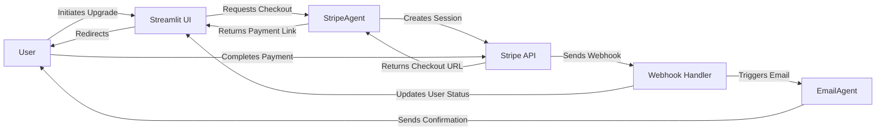

# Subscription System Documentation

## Overview

CoachAI implements a tiered subscription model using Stripe for payment processing. The system offers two tiers:

1. **Freemium** - Basic functionality at no cost
2. **Premium** - Enhanced functionality for a monthly subscription fee

## Architecture

The subscription system consists of:

- **StripeAgent**: Core component that interfaces with Stripe API
- **UI Integration**: Streamlit components for subscription management
- **Webhook Handling**: For processing Stripe event notifications
- **Session State Management**: For tracking user subscription status



## Subscription Tiers

| Feature | Freemium | Premium |
|---------|----------|---------|
| Learning plans per day | 1 | 10 |
| Resources per plan | 3 | 10 |
| Email notifications | ❌ | ✅ |
| Price | Free | $9.99/month |

## Implementation Details

### StripeAgent

The `StripeAgent` class in `agents/stripe_agent.py` handles all Stripe-related operations:

```python
class StripeAgent:
    def __init__(self):
        # Initialize with API key and configure tier settings
        self.stripe = stripe
        self.stripe.api_key = settings.stripe_secret_key
        
        # Configure tiers and their features
        self.tier_configs = {
            SubscriptionTier.FREEMIUM: SubscriptionConfig(
                daily_plans=1,
                resources_per_plan=3,
                email_notifications=False,
                price=0.0,
                tier=SubscriptionTier.FREEMIUM
            ),
            SubscriptionTier.PREMIUM: SubscriptionConfig(
                daily_plans=10,
                resources_per_plan=10,
                email_notifications=True,
                price=9.99,
                tier=SubscriptionTier.PREMIUM
            )
        }
        
    def get_tier_features(self, tier):
        """Get features for a subscription tier."""
        config = self.tier_configs.get(tier, self.tier_configs[SubscriptionTier.FREEMIUM])
        return {
            "daily_plans": config.daily_plans,
            "resources_per_plan": config.resources_per_plan,
            "email_notifications": config.email_notifications,
            "price": config.price
        }
    
    def get_tier_description(self, tier):
        """Get the description of a subscription tier for display."""
        features = self.get_tier_features(tier)
        description = f"""
        - {features['daily_plans']} learning plans per day
        - {features['resources_per_plan']} resources per plan
        - Email notifications: {'Yes' if features['email_notifications'] else 'No'}
        - Price: {'Free' if features['price'] == 0 else f'${features["price"]:.2f}/month'}
        """
        return description
        
    async def create_checkout_session(self, success_url, cancel_url, customer_id=None):
        # Create a Stripe checkout session for subscription payment
        
    async def create_customer(self, email, name=None):
        # Create or retrieve a Stripe customer
        
    def can_create_more_plans(self, tier, plans_created):
        """Check if the user can create more plans based on their tier."""
        max_plans = self.tier_configs.get(tier, self.tier_configs[SubscriptionTier.FREEMIUM]).daily_plans
        return plans_created < max_plans
        
    def get_max_plans(self, tier):
        """Get the maximum number of plans allowed for a tier."""
        return self.tier_configs.get(tier, self.tier_configs[SubscriptionTier.FREEMIUM]).daily_plans
    
    # Other utility methods...
```

### Webhook Handling

Webhooks from Stripe are processed in the `handle_webhook` function in `ui/web/app.py`:

1. **Verification**: Each webhook is verified using the Stripe signature and the `verify_webhook_signature` function
2. **Event Processing**: Different event types trigger different actions:
   - `checkout.session.completed`: Updates user to premium status and stores subscription data
   - `invoice.payment_failed`: Notifies user of payment issues and updates subscription status

```python
def verify_webhook_signature(payload: Dict, signature: str, webhook_secret: str) -> bool:
    """
    Verify the webhook request from Stripe.
    
    Args:
        payload: The webhook payload as a dictionary
        signature: The Stripe signature from the request header
        webhook_secret: The webhook secret from Stripe
        
    Returns:
        bool: True if the signature is valid, False otherwise
    """
    try:
        # Extract timestamp and signatures from the signature
        # Prepare the signed payload
        # Generate and compare the expected signature
        return any(hmac.compare_digest(expected_signature, sig) for sig in signatures)
    except Exception as e:
        print(f"Error verifying webhook signature: {e}")
        return False
```

### UI Integration

The subscription status is displayed in the sidebar of the application:

```python
def subscription_sidebar():
    """Display subscription information in sidebar."""
    st.sidebar.title("📊 Subscription Status")
    
    stripe_agent = st.session_state.stripe_agent
    current_tier = st.session_state.subscription.tier
    
    # Display current tier and features
    st.sidebar.markdown(f"**Current Tier:** {current_tier.value.title()}")
    st.sidebar.markdown(stripe_agent.get_tier_description(current_tier))
    
    # Show upgrade button for freemium users
    if current_tier == SubscriptionTier.FREEMIUM:
        st.sidebar.markdown("---")
        if st.sidebar.button("🌟 Upgrade to Premium"):
            handle_subscription_upgrade()
    
    # Show usage statistics
    st.sidebar.markdown("---")
    st.sidebar.markdown("### Today's Usage")
    max_plans = stripe_agent.get_tier_features(current_tier)["daily_plans"]
    st.sidebar.markdown(f"Plans created today: {st.session_state.plans_created_today}/{max_plans}")
    
    # Add API settings section
    st.sidebar.markdown("---")
    with st.sidebar.expander("⚙️ API Settings"):
        # OpenAI API key configuration
        from src.config import settings
        current_key = settings.openai_api_key
        masked_key = f"{current_key[:5]}...{current_key[-4:]}" if current_key else "Not set"
        
        st.markdown(f"**OpenAI API Key:** {masked_key}")
        new_api_key = st.text_input("Enter OpenAI API Key", type="password")
        
        if st.button("Save API Key"):
            if new_api_key:
                os.environ["OPENAI_API_KEY"] = new_api_key
                settings.openai_api_key = new_api_key
                st.success("API key updated successfully!")
                st.rerun()
```

### Success and Cancel Pages

After payment processing, users are directed to either a success or cancel page:

1. **Success Page**: Displays congratulations, subscription benefits, and next steps
2. **Cancel Page**: Provides information about why premium is beneficial and offers to try again

### Session State Management

The application maintains subscription-related data in Streamlit's session state:

```python
# Initialize subscription tracking if not already present
if not has_subscription:
    from agents.stripe_agent import SubscriptionTier, SubscriptionConfig
    st.session_state.subscription = SubscriptionConfig(
        daily_plans=1,
        resources_per_plan=3,
        email_notifications=False,
        price=0.0,
        tier=SubscriptionTier.FREEMIUM
    )
else:
    # Restore premium status if it existed
    if premium_status:
        st.session_state.subscription.tier = premium_status
```

## URL Routes

- Main route with `?success=true`: Displays success page after successful payment
- Main route with `?cancel=true`: Displays page after canceled payment 
- Main route without parameters: Contains the main application interface

## Configuration

The following environment variables are required:

```
STRIPE_SECRET_KEY=your_stripe_secret_key
STRIPE_WEBHOOK_SECRET=your_webhook_secret
```

## Testing

For local testing:

1. Use Stripe test mode keys
2. Configure webhook forwarding with the Stripe CLI:
   ```
   stripe listen --forward-to localhost:8501/webhook
   ```
3. Test the integration with Stripe test cards (e.g., 4242 4242 4242 4242)

## Troubleshooting

Common issues:

1. **Webhook Verification Fails**: Ensure the webhook secret is correctly set and valid
2. **Session Routing Issues**: Check URL parameter handling in the application
3. **Payment Link Not Working**: Verify Stripe API key and product/price configuration
4. **Premium Features Not Available After Payment**: Check session state persistence and webhook processing
5. **Plan Limits Not Working**: Verify the plans counter is correctly incremented and checked

## Recent Improvements

1. **Robust Session State**: Better handling of subscription tier and plan count tracking
2. **Enhanced Error Handling**: More detailed error messages and logging for Stripe interactions
3. **API Key Management**: In-app configuration of OpenAI API key
4. **Improved User Experience**: Better feedback during payment processing and subscription changes

## Security Considerations

- API keys are stored as environment variables
- Webhook signatures are verified to prevent fraud
- Sensitive payment data is handled by Stripe, not stored in the application
- User subscription status is maintained in session state 
- Payment processing occurs on Stripe's secure infrastructure 