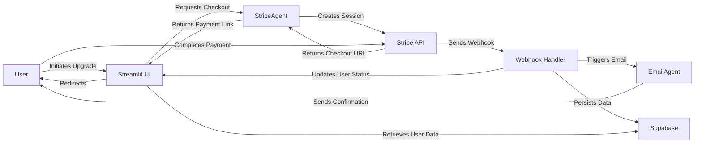

# Subscription System Documentation

## Overview

CoachAI implements a tiered subscription model using Stripe for payment processing, with user data persistence through Supabase. The system offers two tiers:

1. **Freemium** - Basic functionality at no cost
2. **Premium** - Enhanced functionality for a monthly subscription fee

## Architecture

The subscription system consists of:

- **StripeAgent**: Core component that interfaces with Stripe API
- **UI Integration**: Streamlit components for subscription management
- **Webhook Handling**: For processing Stripe event notifications
- **Session State Management**: For tracking user subscription status
- **Supabase Storage**: For persisting user subscription data



## Subscription Tiers

| Feature | Freemium | Premium |
|---------|----------|---------|
| Learning plans per day | 1 | 10 |
| Resources per plan | 3 | 10 |
| Email notifications | ❌ | ✅ |
| Time tracking | ✅ | ✅ |
| Dashboard analytics | ✅ | ✅ |
| Price | Free | $9.99/month |

## Implementation Details

### StripeAgent

The `StripeAgent` class in `agents/stripe_agent.py` handles all Stripe-related operations:

```python
class StripeAgent:
    def __init__(self):
        # Initialize with API key and configure tier settings
        self.stripe = stripe
        self.stripe.api_key = settings.stripe_secret_key
        
        # Configure tiers and their features
        self.tier_configs = {
            SubscriptionTier.FREEMIUM: SubscriptionConfig(
                tier=SubscriptionTier.FREEMIUM,
                daily_plans=1,
                resources_per_plan=3,
                email_notifications=False,
                price=0.0
            ),
            SubscriptionTier.PREMIUM: SubscriptionConfig(
                tier=SubscriptionTier.PREMIUM,
                daily_plans=10,
                resources_per_plan=10,
                email_notifications=True,
                price=9.99
            )
        }
        
    def get_tier_features(self, tier):
        """Get features for a subscription tier."""
        config = self.tier_configs.get(tier, self.tier_configs[SubscriptionTier.FREEMIUM])
        return {
            "daily_plans": config.daily_plans,
            "resources_per_plan": config.resources_per_plan,
            "email_notifications": config.email_notifications,
            "price": config.price
        }
    
    def get_tier_description(self, tier):
        """Get the description of a subscription tier for display."""
        features = self.get_tier_features(tier)
        description = f"""
        - {features['daily_plans']} learning plans per day
        - {features['resources_per_plan']} resources per plan
        - Email notifications: {'Yes' if features['email_notifications'] else 'No'}
        - Price: {'Free' if features['price'] == 0 else f'${features["price"]:.2f}/month'}
        """
        return description
        
    async def create_checkout_session(self, success_url, cancel_url, customer_id=None):
        # Create a Stripe checkout session for subscription payment
        
    async def create_customer(self, email, name=None):
        # Create or retrieve a Stripe customer
        
    def can_create_more_plans(self, tier, plans_created):
        """Check if the user can create more plans based on their tier."""
        max_plans = self.tier_configs.get(tier, self.tier_configs[SubscriptionTier.FREEMIUM]).daily_plans
        return plans_created < max_plans
        
    def get_max_plans(self, tier):
        """Get the maximum number of plans allowed for a tier."""
        return self.tier_configs.get(tier, self.tier_configs[SubscriptionTier.FREEMIUM]).daily_plans
    
    # Other utility methods...
```

### Webhook Handling

Webhooks from Stripe are processed in the `handle_webhook` function in `ui/web/app.py`:

1. **Verification**: Each webhook is verified using the Stripe signature and the `verify_webhook_signature` function
2. **Event Processing**: Different event types trigger different actions:
   - `checkout.session.completed`: Updates user to premium status and stores subscription data
   - `invoice.payment_failed`: Notifies user of payment issues and updates subscription status

```python
def verify_webhook_signature(payload: Dict, signature: str, webhook_secret: str) -> bool:
    """
    Verify the webhook request from Stripe.
    
    Args:
        payload: The webhook payload as a dictionary
        signature: The Stripe signature from the request header
        webhook_secret: The webhook secret from Stripe
        
    Returns:
        bool: True if the signature is valid, False otherwise
    """
    try:
        # Extract timestamp and signatures from the signature
        # Prepare the signed payload
        # Generate and compare the expected signature
        return any(hmac.compare_digest(expected_signature, sig) for sig in signatures)
    except Exception as e:
        print(f"Error verifying webhook signature: {e}")
        return False
```

### UI Integration

The subscription status is displayed in the Settings page of the application:

```python
def render_subscription_tab():
    """Display subscription information in the Settings page."""
    
    stripe_agent = st.session_state.stripe_agent
    current_tier = st.session_state.subscription.tier
    
    # Display current tier and features
    st.markdown(f"## Current Tier: {current_tier.value.title()}")
    st.markdown(stripe_agent.get_tier_description(current_tier))
    
    # Show upgrade button for freemium users
    if current_tier == SubscriptionTier.FREEMIUM:
        st.markdown("---")
        if st.button("🌟 Upgrade to Premium"):
            handle_subscription_upgrade()
    
    # Show usage statistics
    st.markdown("---")
    st.markdown("### Today's Usage")
    max_plans = stripe_agent.get_tier_features(current_tier)["daily_plans"]
    st.markdown(f"Plans created today: {st.session_state.plans_created_today}/{max_plans}")
```

### API Key Management

The OpenAI API key is managed in the Settings page:

```python
def render_api_settings_tab():
    """Display API settings in the Settings page."""
    st.markdown("## OpenAI API Key Configuration")
    
    # Display instructions for getting an API key
    st.markdown("""
    To use CoachAI, you need an OpenAI API key with GPT-4 access. If you don't have one:
    
    1. Go to [OpenAI API Keys](https://platform.openai.com/api-keys)
    2. Create a new secret key
    3. Copy and paste it below
    """)
    
    # Show current key status
    from src.config import settings
    current_key = settings.openai_api_key
    
    if current_key:
        # Only show the first few and last few characters of the API key
        masked_key = f"{current_key[:5]}...{current_key[-4:]}" if len(current_key) > 10 else "****"
        st.success(f"✅ OpenAI API Key: {masked_key}")
    else:
        st.warning("⚠️ No OpenAI API key set. Please enter your key below.")
    
    # Input field for new API key
    new_api_key = st.text_input("Enter OpenAI API Key", type="password")
    
    if st.button("Save API Key"):
        if new_api_key:
            # Update the API key in session and configuration
            os.environ["OPENAI_API_KEY"] = new_api_key
            settings.openai_api_key = new_api_key
            
            # Store in user data if available
            if "storage_client" in st.session_state and "user_id" in st.session_state:
                st.session_state.storage_client.store_api_key(
                    st.session_state.user_id, 
                    encrypt_api_key(new_api_key)
                )
                
            st.success("API key saved successfully!")
            st.rerun()
```

### Supabase Integration

User data including subscription status is stored in Supabase:

```python
class SupabaseStorage:
    def __init__(self, url, api_key):
        """Initialize Supabase client."""
        self.supabase = create_client(url, api_key)
        
    def upsert_user_data(self, user_data):
        """Store or update user data in Supabase."""
        # Prepare data for storage (convert complex objects to JSON)
        storage_data = {
            "user_id": user_data["user_id"],
            "learning_plan": json.dumps(user_data["learning_plan"]) if user_data["learning_plan"] else None,
            "time_logs": json.dumps(user_data["time_logs"]),
            "actual_time_spent": user_data["actual_time_spent"],
            "theme_mode": user_data["theme_mode"],
            "subscription_tier": user_data["subscription"],
            "updated_at": datetime.now().isoformat()
        }
        
        # Store in users table
        self.supabase.table("users").upsert(storage_data).execute()
        
    def get_user_data(self, user_id):
        """Retrieve user data from Supabase."""
        response = self.supabase.table("users").select("*").eq("user_id", user_id).execute()
        
        if response.data and len(response.data) > 0:
            user_data = response.data[0]
            
            # Convert JSON strings back to Python objects
            if user_data.get("learning_plan"):
                user_data["learning_plan"] = json.loads(user_data["learning_plan"])
                
            if user_data.get("time_logs"):
                user_data["time_logs"] = json.loads(user_data["time_logs"])
                
            return user_data
            
        return None
        
    def store_api_key(self, user_id, encrypted_key):
        """Store encrypted API key for user."""
        self.supabase.table("api_keys").upsert({
            "user_id": user_id,
            "api_key": encrypted_key,
            "updated_at": datetime.now().isoformat()
        }).execute()
```

### Success and Cancel Pages

After payment processing, users are directed to either a success or cancel page:

1. **Success Page**: Displays congratulations, subscription benefits, and next steps
2. **Cancel Page**: Provides information about why premium is beneficial and offers to try again

### Session State Management

The application maintains subscription-related data in Streamlit's session state:

```python
# Initialize subscription tracking if not already present
if "subscription" not in st.session_state:
    from agents.stripe_agent import SubscriptionTier, SubscriptionConfig
    st.session_state.subscription = SubscriptionConfig(
        tier=SubscriptionTier.FREEMIUM,
        daily_plans=1,
        resources_per_plan=3,
        email_notifications=False,
        price=0.0
    )
else:
    # Restore premium status if it existed
    if premium_status:
        st.session_state.subscription.tier = premium_status
```

## URL Routes

- Main route with `?success=true`: Displays success page after successful payment
- Main route with `?cancel=true`: Displays page after canceled payment 
- Main route without parameters: Contains the main application interface

## Configuration

The following environment variables are required:

```
STRIPE_SECRET_KEY=your_stripe_secret_key
STRIPE_WEBHOOK_SECRET=your_webhook_secret
OPENAI_API_KEY=your_openai_api_key
SUPABASE_URL=your_supabase_url
SUPABASE_KEY=your_supabase_key
```

## Testing

For local testing:

1. Use Stripe test mode keys
2. Configure webhook forwarding with the Stripe CLI:
   ```
   stripe listen --forward-to localhost:8501/webhook
   ```
3. Test the integration with Stripe test cards (e.g., 4242 4242 4242 4242)

## Troubleshooting

Common issues:

1. **Webhook Verification Fails**: Ensure the webhook secret is correctly set and valid
2. **SubscriptionConfig Initialization Error**: Make sure to provide the 'tier' parameter first when creating a SubscriptionConfig object
3. **API Key Not Working**: Check if the key is valid and has proper permissions for GPT-4
4. **Supabase Connection Issues**: Verify your Supabase URL and API key are correctly configured

## Recent Improvements

1. **Robust Session State**: Better handling of subscription tier and plan count tracking
2. **Enhanced Error Handling**: More detailed error messages and logging for Stripe interactions
3. **API Key Management**: In-app configuration of OpenAI API key
4. **Improved User Experience**: Better feedback during payment processing and subscription changes

## Security Considerations

- API keys are stored as environment variables
- Webhook signatures are verified to prevent fraud
- Sensitive payment data is handled by Stripe, not stored in the application
- User subscription status is maintained in session state 
- Payment processing occurs on Stripe's secure infrastructure 